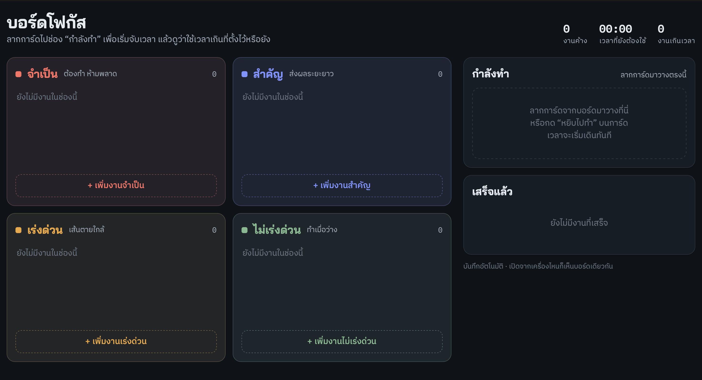

# บอร์ดโฟกัส

A task board with four boxes: จำเป็น (necessary), สำคัญ (important), เร่งด่วน (urgent), and ไม่เร่งด่วน (not urgent). Drag a card into **กำลังทำ** (doing) to start its timer. The timer shows time spent against the card's estimate and warns you once you pass it.



## Run locally

```bash
npm start        # or: node server.js
```

Then open http://localhost:3000. You only need Node 18 or newer. There are no packages to install.

## Where the tasks are stored

Tasks are saved to `data/tasks.json` on your machine. `data/` is listed in `.gitignore`, so your tasks never get committed or pushed. The repository contains only the app.

If you open `index.html` directly without the server, tasks are stored in that browser's localStorage instead.
